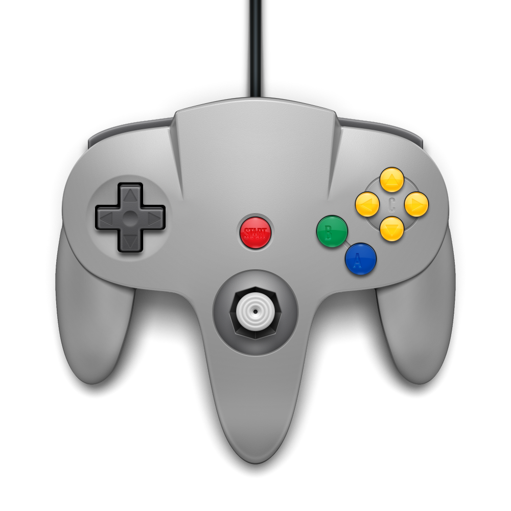
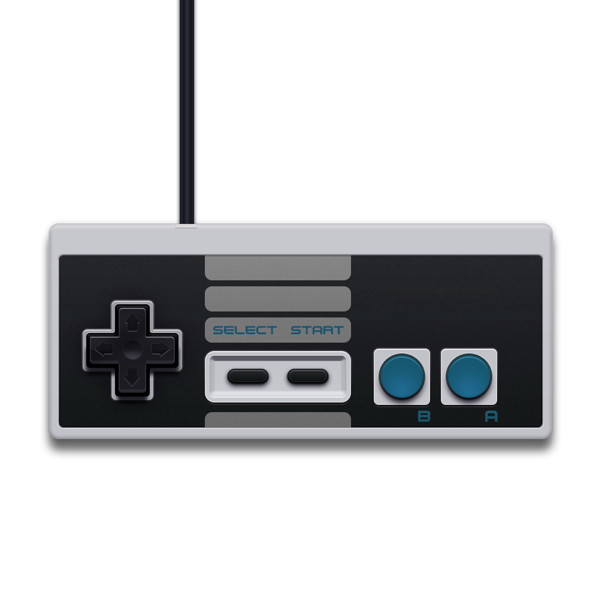

# Kodi Game Controller Add-ons

Kodi has controller profiles for each systems it supports. Add-ons consist of several files:

1. [addon.xml](https://github.com/kodi-game/kodi-game-controllers/blob/master/addons/game.controller.default/addon.xml) - the add-on fluff

2. [layout.xml](https://github.com/kodi-game/kodi-game-controllers/blob/master/addons/game.controller.default/resources/layout.xml) - the controller layout (geometry is optional)

3. [layout.png](https://github.com/kodi-game/kodi-game-controllers/blob/master/addons/game.controller.default/resources/layout.png) - the picture shown in the configuration GUI

4. resources/language/English/[strings.po](https://github.com/kodi-game/kodi-game-controllers/blob/master/addons/game.controller.default/resources/language/English/strings.po) - The names of the buttons

5. icon.png - the thumbnail used in the GUI

### List of controllers

##### Default (Xbox 360) controller

##### Sega Dreamcast

##### Game Boy Advance

##### Genesis controller

##### N64 controller

##### NES controller

##### PlayStation controller

##### SNES controller

#### MSX Joystick (WIP)

#### MSX Limited Keyboard (WIP)
Only numkeys 1 to 9 and 0, arrows and spacebar

