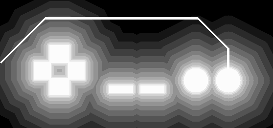
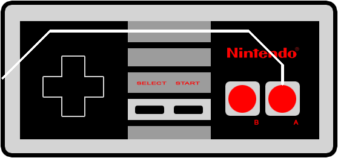
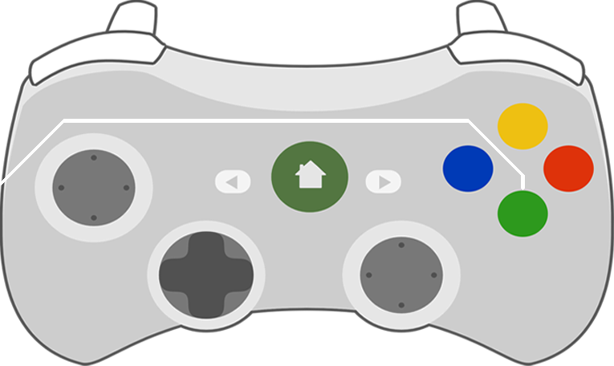

## Visualization experiment

While building RetroPlayer I thought of a cool way for the user to visualize the mapping process:

Notice how the lines follow specific, non-overlapping paths without covering a button. The idea is to do this for every controller through gaming history. Line drawing will have to be done automatically.

## Controller profiles

I created a new kind of add-on for Kodi, "Controller profiles", to provide pictures and metadata for the various game console controllers that Kodi supports. Each controller profile contains a layout that will be shown in the GUI:

I loaded this image in GIMP and extracted the coordinates for the buttons. I placed these coords in the addon.xml file to be shipped with the add-on.

## Cost map

To generate the lines automatically, I wrote a Python script that generates a "cost map", where pixel brightness corresponds to the cost of drawing a line through that pixel.

I used OpenCV to render the buttons as they are given in addon.xml, and then dialated the image with an increasing number of iterations to make the cost "fan out" from the buttons.

The best path from button to label should have a few constraints:

* Contact between line and button should be perpendicular
* At most 1 vertical segment, and (subject to being perpendicular) only if line starts on button top or bottom
* At most 2 horizontal segments, at most 2 diagonal segments

The pathfinder is straight-forward A* search under the constraints above. Initial tests are promising:

A* in python is too slow to run in realtime, so I'll probably generate these paths offline and include them in a `resources/` folder. This way, we can generate an array of paths that skins can select from, depending on where they wish to place the button labels.

